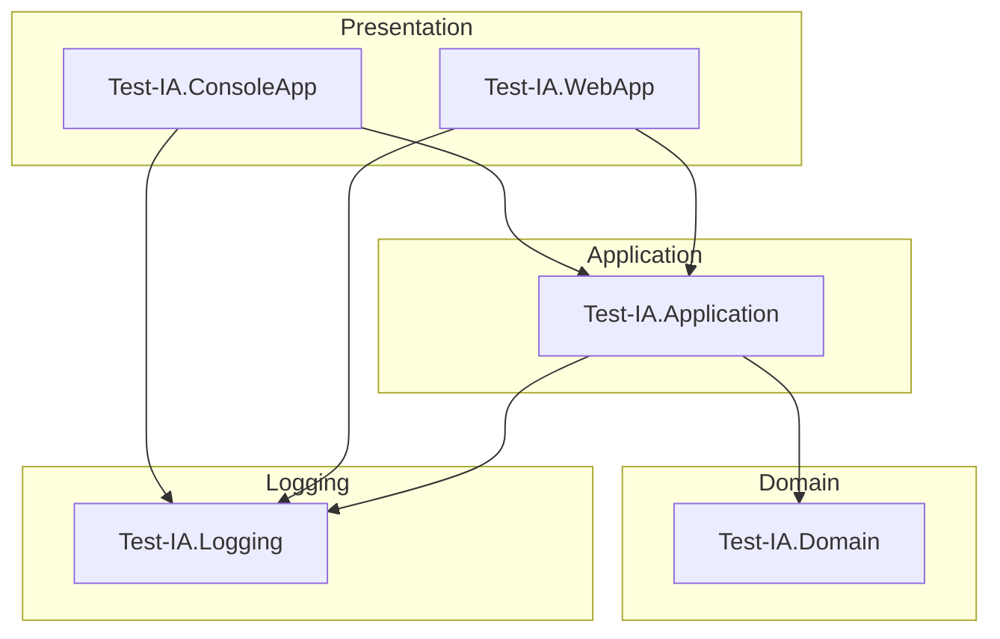

# Test-IA

A .NET 10.0 solution that demonstrates Active Directory user and group lookup services using real LDAP connections with Windows Integrated Authentication.

## Table of Contents

- [Test-IA](#test-ia)
  - [Table of Contents](#table-of-contents)
  - [Overview](#overview)
  - [Architecture](#architecture)
  - [Layer Responsibilities](#layer-responsibilities)
  - [Projects](#projects)
  - [Public Services](#public-services)
    - [IGetADUserInfo](#igetaduserinfo)
    - [IGetADGroupInfo](#igetadgroupinfo)
    - [IGroupMembershipWriter](#igroupmembershipwriter)
    - [IUserGroupAuthorizationService](#iusergroupauthorizationservice)
    - [IUserWriter](#iuserwriter)
  - [Dependency Injection](#dependency-injection)
  - [Configuration](#configuration)
  - [Getting Started](#getting-started)
    - [Prerequisites](#prerequisites)
    - [Console Application](#console-application)
  - [Testing](#testing)
  - [Deployment](#deployment)
    - [Self-Contained Deployment Package](#self-contained-deployment-package)
      - [Automated Publishing Script](#automated-publishing-script)
      - [Manual Publishing](#manual-publishing)
      - [Deployment Package Contents](#deployment-package-contents)
      - [Deploying the Package](#deploying-the-package)
      - [Running as a Windows Service (Production)](#running-as-a-windows-service-production)
      - [Prerequisites for Deployment](#prerequisites-for-deployment)
  - [Coding Standards](#coding-standards)
  - [Technology Stack](#technology-stack)
  - [Repository Structure](#repository-structure)
  - [Last Updated](#last-updated)

## Overview

**Test-IA** is a .NET 10.0 solution that demonstrates Active Directory (AD DS) user and group information retrieval using real LDAP connections with Windows Integrated Authentication. The solution includes **group-based authorization** that restricts access to users who are members of a configured Active Directory group (e.g., "Employees of IT"). Users can **add and remove members from groups** via the WebApp Groups page.

## Architecture

The solution uses **Clean Architecture** with the following layers:



## Layer Responsibilities

| Layer | Responsibility |
|---|---|
| **Domain** | Service interfaces (`IGetADUserInfo`, `IGetADGroupInfo`, `IUserGroupAuthorizationService`, `IUserWriter`, `IGroupMembershipWriter`, `ICurrentUser`), DTOs (`UserDto`, `GroupDto`, `GroupMemberOperationResult`), and domain exceptions (`DomainException`, `AccessDeniedException`, `MissingGroupException`, `UserNotFoundException`, `GroupNotFoundException`) |
| **Application** | Service implementations, Active Directory discovery (with internal caching), LDAP connection management, group authorization logic, DI registration, **Attribute Mapper pattern** for LDAP-to-DTO mapping with `GetDisplayValues()` for dynamic rendering. Includes `UserAttributeMapper` (14 LDAP attributes), `GroupAttributeMapper`, `UserUpdateAttributeMapper`, `GroupMembershipWriterService` (LDAP modify operations for adding group members), `ICurrentUser` implementations (`ConsoleCurrentUser`, `WebCurrentUser`) for identity resolution, and `CurrentUserMockHelper` for test mocking. |
| **Logging** | `ILoggerService` abstraction wrapping `Microsoft.Extensions.Logging.ILogger` |
| **ConsoleApp** | Composition root, service registration, authorization check, and demonstration of real AD operations with dynamic attribute display via `GetDisplayValues()` |
| **WebApp** | ASP.NET Core Razor Pages presentation layer with HTML5 interface, dynamic attribute display via `GetDisplayValues()` for User, Group, and Update operations. User Search panel displays all 14 LDAP attributes dynamically. User Update card supports all 10 LDAP attributes with dynamic form field rendering. **Groups.cshtml** dedicated page for group search, adding members to groups, and removing members from groups via `IGroupMembershipWriter` (single form with `Action` button routing). Two distinct sections (Users and Groups) with visual differentiation. Glassmorphism + Aurora UI. Navbar badge displays the current Windows user's identity (`DOMAIN\\Username`) via `WindowsIdentity.GetCurrent()?.Name`. Logging service uses extensible sink pattern (`ILoggingSink`) — file, console, database, Event Log sinks are pluggable via `appsettings.json` `Logging.Sinks` section. |

## Projects

| Project | Type | Target Framework | Description | Depends On |
|---|---|---|---|---|
| Test-IA.Domain | Class Library | net10.0 | Domain interfaces, DTOs, and exceptions | None |
| Test-IA.Application | Class Library | net10.0 | Service implementations, AD discovery, LDAP access, Attribute Mappers | Test-IA.Domain |
| Test-IA.Logging | Class Library | net10.0 | Logging abstraction | None |
| Test-IA.ConsoleApp | Console Application | net10.0 | Composition root and AD demonstration | Test-IA.Application, Test-IA.Logging |
| Test-IA.WebApp | Web Application | net10.0 | ASP.NET Core Razor Pages web interface for AD lookups | Test-IA.Application, Test-IA.Domain, Test-IA.Logging |
| Test-IA.Tests | Test Project | net10.0 | Unit tests for all projects | Test-IA.Domain, Test-IA.Application, Test-IA.Logging |

## Public Services

### IGetADUserInfo

Retrieves Active Directory user information by `samAccountName`.

**Returns:** `UserDto` with `DisplayName`, `EmployeeId`, `Mail`, `UserPrincipalName`, `Info`, `Mobile`, `SamAccountName`, `StreetAddress`, `City`, `State`, `PostalCode`, `Department`, `Title`, `PhoneNumber`

### IGetADGroupInfo

Retrieves Active Directory group information by `samAccountName`.

**Returns:** `GroupDto` with `DisplayName` and `Members` (array of resolved display names, not DNs)

### IGroupMembershipWriter

Adds or removes a user as a member of an Active Directory group via LDAP modify operations.

**Methods:**
- `AddMember(groupSamAccountName, memberSamAccountName)` — Adds a user as a member to a group.
- `RemoveMember(groupSamAccountName, memberSamAccountName)` — Removes a user from a group.

**Parameters:** `groupSamAccountName`, `memberSamAccountName`

**Returns:** `GroupMemberOperationResult` with `Success` status and descriptive message

### IUserGroupAuthorizationService

Checks whether the current Windows user is a member of a configured Active Directory group.

Uses `ICurrentUser` abstraction for identity resolution: `ConsoleCurrentUser` reads from `WindowsIdentity.GetCurrent()`, `WebCurrentUser` reads from `HttpContext.User`. Both extract the short `samAccountName` (after the last `\`) required by LDAP `sAMAccountName` searches.

**Returns:** `bool` — `true` if the user is a group member, `false` otherwise.

### IUserWriter

Updates Active Directory user attributes via LDAP modify operations.

**Supported attributes:** `info`, `mobile`, `streetAddress`, `l` (city), `st` (state), `postalCode`, `department`, `title`, `telephoneNumber`

## Dependency Injection

All services are registered via `ServiceCollectionExtensions.AddTestIAServices()` in the composition root (`Program.cs`). Services are registered as **Scoped** (new instance per DI scope).

**Registrations:**
- `ADDomainDiscoveryService` → Scoped
- `IAttributeMapper<UserDto>` / `UserAttributeMapper` → Scoped
- `IAttributeMapper<GroupDto>` / `GroupAttributeMapper` → Scoped
- `IGetADUserInfo` / `GetADUserInfoService` → Scoped
- `IGetADGroupInfo` / `GetADGroupInfoService` → Scoped
- `IUserGroupAuthorizationService` / `UserGroupAuthorizationService` → Scoped
- `IUserWriter` / `UserWriterService` → Scoped
- `IGroupMembershipWriter` / `GroupMembershipWriterService` → Scoped
- `IAttributeMapper<UserUpdateRequest>` / `UserUpdateAttributeMapper` → Scoped
- `ICurrentUser` / `ConsoleCurrentUser` (ConsoleApp) or `WebCurrentUser` (WebApp) → Scoped
- `HttpContextAccessor` → Singleton (WebApp only, via `AddHttpContextAccessor()`)

## Configuration

- **ConsoleApp:** `appsettings.json` and `appsettings.Development.json` with structured logging configuration via `Microsoft.Extensions.Configuration.Json`.
- **WebApp:** ASP.NET Core default configuration (`appsettings.json`, `appsettings.Development.json`, environment variables).
- **Authorization:** `Authorization.RequiredGroup` in `appsettings.json` — the AD group `sAMAccountName` that users must be a member of to access the application.

## Getting Started

### Prerequisites

- Windows machine joined to an Active Directory domain
- .NET 10.0 SDK installed

### Console Application

```powershell
dotnet restore
dotnet build
dotnet run --project src/Test-IA.ConsoleApp
```

The console application will:
1. Discover the Active Directory environment
2. Check if the current user is a member of the configured authorization group (e.g., "Employees of IT")
3. Search for user `MFVA649T`
4. Search for group `employees of MADRID`
5. Display results through the logging abstraction

**Authorization:** If the current user is not a member of the configured group, the application logs an error and exits immediately. If the configured group does not exist in Active Directory, the application logs a `MissingGroupException` and exits.

**Web Application:**
```powershell
dotnet restore
dotnet build
dotnet run --project src/Test-IA.WebApp
```

The web application will start a Kestrel web server and serve the Razor Pages interface at `https://localhost:5001` (or the configured HTTPS port). Open a browser and navigate to the URL to access the Active Directory lookup interface.

**Authorization:** The web application requires Windows Integrated Authentication. Users must be authenticated via Kerberos/NTLM and be a member of the configured authorization group (e.g., "Employees of IT"). Non-authenticated or non-member users receive a 401 Unauthorized response.

## Testing

**Framework:** xUnit with NSubstitute and FluentAssertions

**Command:**
```powershell
dotnet test
```

**Test Categories:**
- **LoggingServiceTests** (7 tests) — Constructor validation, null message handling, valid message handling
- **GetADUserInfoServiceTests** (3 tests) — Discovery failure, null/empty samAccountName
- **GetADGroupInfoServiceTests** (3 tests) — Discovery failure, null/empty samAccountName
- **MissingGroupExceptionTests** (3 tests) — Exception construction, inheritance from DomainException
- **UserGroupAuthorizationServiceTests** (6 tests) — Discovery failure, constructor validation, null dependency checks

> Tests pending execution.

## Deployment

### Self-Contained Deployment Package

The solution supports **self-contained deployment** — the published package includes the full .NET 10.0 runtime, so no runtime installation is required on the target machine.

#### Automated Publishing Script

A PowerShell script automates the entire build-and-package pipeline:

```powershell
.\scripts\publish-webapp.ps1
```

**Pipeline (6 steps):**

| Step | Command | Purpose |
|------|---------|---------|
| 1/6 | `dotnet clean` | Removes old build artifacts |
| 2/6 | `dotnet restore` | Downloads NuGet packages |
| 3/6 | `dotnet build --configuration Release` | Compiles all projects |
| 4/6 | `dotnet test` | Runs unit tests (aborts on failure) |
| 5/6 | `dotnet publish --self-contained true --runtime win-x64` | Produces the self-contained bundle |
| 6/6 | `Compress-Archive` + embedded README | Wraps into a timestamped `.zip` |

**Parameters:**

| Parameter | Default | Purpose |
|-----------|---------|---------|
| `-Configuration` | `"Release"` | Build configuration (`Release` or `Debug`) |
| `-RuntimeIdentifier` | `"win-x64"` | Target platform |
| `-OutputPath` | `""` (empty) | Custom output folder (default: `releases/publish/`) |
| `-SkipTests` | `$false` | Skip unit tests for quick rebuilds |

**Examples:**

```powershell
# Default: full pipeline, output to releases/publish
.\scripts\publish-webapp.ps1

# Custom output folder
.\scripts\publish-webapp.ps1 -OutputPath "C:\deploy\webapp"

# Skip tests for a quick rebuild
.\scripts\publish-webapp.ps1 -SkipTests

# Debug configuration
.\scripts\publish-webapp.ps1 -Configuration Debug
```

#### Manual Publishing

```powershell
dotnet publish src/Test-IA.WebApp/Test-IA.WebApp.csproj `
    --configuration Release `
    --runtime win-x64 `
    --self-contained true `
    --output releases/publish
```

#### Deployment Package Contents

| File/Folder | Description |
|-------------|-------------|
| `Test-IA.WebApp.exe` | Self-contained executable (includes .NET 10 runtime) |
| `Test-IA.Application.dll` + `.pdb` | Application layer |
| `Test-IA.Domain.dll` + `.pdb` | Domain layer |
| `Test-IA.Logging.dll` + `.pdb` | Logging layer |
| `appsettings.json` | Default configuration |
| `appsettings.Development.json` | Development overrides |
| `wwwroot/` | Static web assets (CSS, JS) |
| `coreclr.dll`, `hostfxr.dll` | .NET runtime (bundled) |

#### Deploying the Package

1. **Copy** the zip file to the target server:
   ```powershell
   Copy-Item Test-IA.WebApp-deploy-*.zip \\target-server\C$\deploy\
   ```

2. **Extract** on the target server:
   ```powershell
   Expand-Archive Test-IA.WebApp-deploy-*.zip -DestinationPath "C:\WebApps\Test-IA"
   ```

3. **Run** the application:
   ```powershell
   cd "C:\WebApps\Test-IA"
   .\Test-IA.WebApp.exe
   ```

4. **Access** in a browser:
   ```
   http://localhost:5000
   ```

#### Running as a Windows Service (Production)

To run as a background service, use [NSSM](https://nssm.cc/):

```powershell
# Install NSSM
choco install nssm

# Register the service
nssm install Test-IA.WebApp "C:\WebApps\Test-IA\Test-IA.WebApp.exe"
nssm set Test-IA.WebApp Directory "C:\WebApps\Test-IA"
nssm start Test-IA.WebApp
```

#### Prerequisites for Deployment

- **Windows machine** joined to an Active Directory domain
- **.NET 10.0 Runtime** is NOT required (bundled with this package)
- Network access to at least one Domain Controller
- User account running the app must have LDAP read access to the domain and must be authorized to update users and groups managed by the app
- Must define SPNs for the user account running the app (PROTOCOL = HTTP and/or HTTPS):
   ```powershell
   setspn -S <PROTOCOL>/<SERVER> <DOMAIN>\<USER-SAMACCOUNTNAME>, for example: setspn -S http://covadonga-srv:5000
   setspn -S <PROTOCOL>/<SERVER-FQDN> <DOMAIN>\<USER-SAMACCOUNTNAME>, for example: setspn -S https://covadonga-srv.asturmalaga.com:5000
   ```
- Add service URLs to the policy `Computer Configuration → Policies → Administrative Templates → Windows Components → Internet Explorer → Internet Control Panel → Security Page → Site to Zone Assignment List`:
  ```
  <PROTOCOL>://<SERVER>:<PORT>      1, for example: http://covadonga-srv:5000                   1 
  <PROTOCOL>://<SERVER-FQDN>:<PORT> 1, for example: http://covadonga-srv.asturmalaga.com:5000   1 
  ```
- The server where the app is running must have an domain `inbound rule` to allow TCP and UDP `<PORT>` communication  

## Coding Standards

- **Nullable reference types:** Enabled
- **File-scoped namespaces:** Used
- **Implicit usings:** Enabled
- **XML documentation comments:** Mandatory for all public members
- **Modern C# features:** Primary constructors, collection expressions, pattern matching
- **Async/await:** Used for I/O operations with `CancellationToken`
- **Exception handling:** Domain exceptions with proper wrapping

## Technology Stack

| Category | Technology |
|---|---|
| Framework | .NET 10.0 |
| Language | C# |
| DI Container | Microsoft.Extensions.DependencyInjection |
| Configuration | Microsoft.Extensions.Configuration.Json, Microsoft.Extensions.Options |
| Logging | Microsoft.Extensions.Logging |
| LDAP Access | System.DirectoryServices.Protocols |
| AD Discovery | System.DirectoryServices.ActiveDirectory |
| Windows Auth | System.Security.Principal.WindowsIdentity |
| Web Auth | Microsoft.AspNetCore.Authentication.Negotiate |
| Testing | xUnit, NSubstitute, FluentAssertions |

## Repository Structure

```
Test-IA/
├── src/
│   ├── Test-IA.Domain/          # Interfaces, DTOs, exceptions
│   ├── Test-IA.Application/     # Service implementations, AD discovery, Attribute Mappers
│   ├── Test-IA.Logging/         # Logging abstraction
│   ├── Test-IA.ConsoleApp/      # Composition root, Main method
│   └── Test-IA.WebApp/          # ASP.NET Core Razor Pages web interface
├── tests/
│   └── Test-IA.Tests/           # xUnit tests
├── scripts/
│   └── publish-webapp.ps1       # Automated build-and-package deployment script
├── releases/
│   ├── publish/                 # Published self-contained output (349 files)
│   └── Test-IA.WebApp-deploy-*.zip  # Deployment package (zip)
├── Test-IA.slnx                  # Solution file
└── memory-bank/                  # Project memory bank
```

## Last Updated

21/08/2026 20:03


