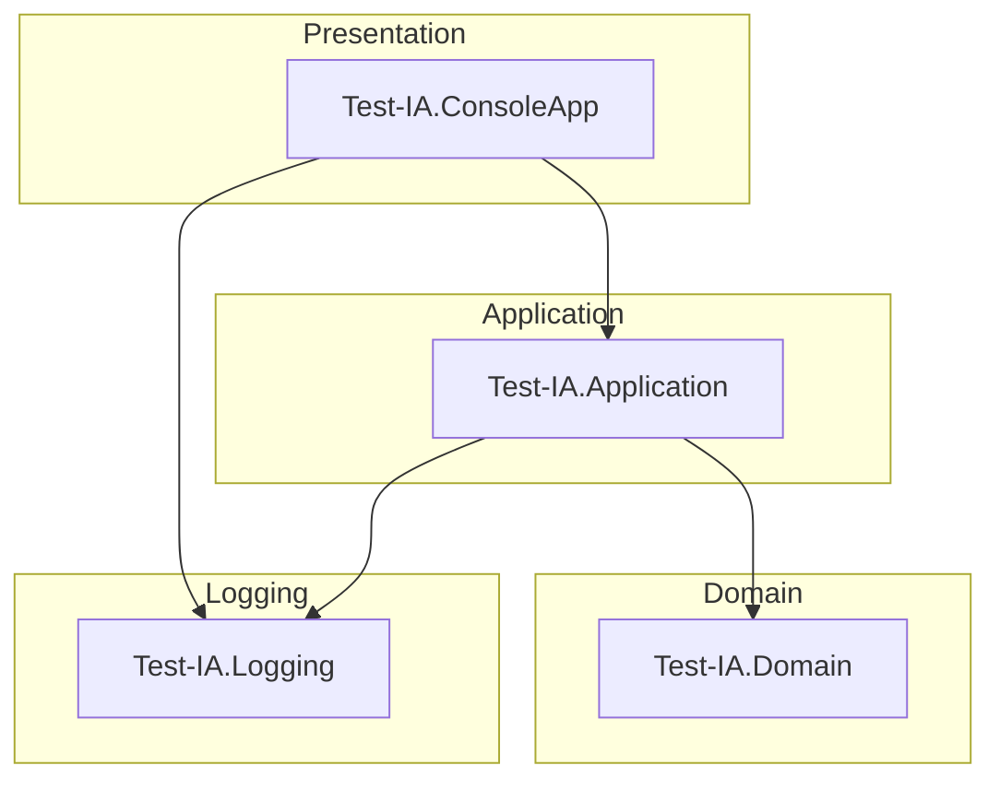

# Test-IA

A .NET 10.0 solution that demonstrates Active Directory user and group lookup services using real LDAP connections with Windows Integrated Authentication.

## Table of Contents

- [Overview](#overview)
- [Architecture](#architecture)
- [Layer Responsibilities](#layer-responsibilities)
- [Projects](#projects)
- [Public Services](#public-services)
- [Dependency Injection](#dependency-injection)
- [Configuration](#configuration)
- [Getting Started](#getting-started)
- [Testing](#testing)
- [Coding Standards](#coding-standards)
- [Technology Stack](#technology-stack)
- [Repository Structure](#repository-structure)
- [Last Updated](#last-updated)

## Overview

**Test-IA** is a .NET 10.0 console application that demonstrates Active Directory (AD DS) user and group information retrieval using real LDAP connections. The solution follows Clean Architecture principles and uses Windows Integrated Authentication (Kerberos/Negotiate) to connect to the domain without requiring explicit credentials.

## Architecture

The solution uses **Clean Architecture** with the following layers:



## Layer Responsibilities

| Layer | Responsibility |
|---|---|
| **Domain** | Service interfaces (`IGetADUserInfo`, `IGetADGroupInfo`), DTOs (`UserDto`, `GroupDto`), and domain exceptions |
| **Application** | Service implementations, Active Directory discovery, LDAP connection management, DI registration |
| **Logging** | `ILoggerService` abstraction wrapping `Microsoft.Extensions.Logging.ILogger` |
| **ConsoleApp** | Composition root, service registration, and demonstration of real AD operations |

## Projects

| Project | Type | Target Framework | Description | Depends On |
|---|---|---|---|---|
| Test-IA.Domain | Class Library | net10.0 | Domain interfaces, DTOs, and exceptions | None |
| Test-IA.Application | Class Library | net10.0 | Service implementations, AD discovery, LDAP access | Test-IA.Domain |
| Test-IA.Logging | Class Library | net10.0 | Logging abstraction | None |
| Test-IA.ConsoleApp | Console Application | net10.0 | Composition root and AD demonstration | Test-IA.Application, Test-IA.Logging |
| Test-IA.Tests | Test Project | net10.0 | Unit tests for all projects | Test-IA.Domain, Test-IA.Application, Test-IA.Logging |

## Public Services

### IGetADUserInfo

Retrieves Active Directory user information by `samAccountName`.

**Returns:** `UserDto` with `DisplayName`, `EmployeeId`, `Mail`, `UserPrincipalName`

### IGetADGroupInfo

Retrieves Active Directory group information by `samAccountName`.

**Returns:** `GroupDto` with `DisplayName` and `Members` (array of distinguished names)

## Dependency Injection

All services are registered via `Microsoft.Extensions.DependencyInjection` in the console application's `Program.cs`:

- `ADDomainDiscoveryService` (Scoped)
- `IGetADUserInfo` / `GetADUserInfoService` (Scoped)
- `IGetADGroupInfo` / `GetADGroupInfoService` (Scoped)
- `ILoggerService` / `LoggingService` (Singleton)

## Configuration

No static configuration is required. The application dynamically discovers:

- Active Directory domain (via `Domain.GetCurrentDomain()`)
- Domain Controller (via `DirectoryEntry` RootDSE)
- LDAP Base DN (via `defaultNamingContext` attribute)

Authentication uses **Windows Integrated Authentication** (Negotiate/Kerberos) with the current user's security context.

## Getting Started

### Prerequisites

- **Windows machine joined to an Active Directory domain**
- **.NET 10.0 SDK**

### Build and Run

```powershell
dotnet restore
dotnet build
dotnet run --project src/Test-IA.ConsoleApp
```

The console application will:
1. Discover the Active Directory environment
2. Search for user `MFVA649T`
3. Search for group `employees of MADRID`
4. Display results through the logging abstraction

## Testing

**Framework:** xUnit with NSubstitute and FluentAssertions

**Command:**
```powershell
dotnet test
```

**Test Categories:**
- **LoggingServiceTests** (7 tests) - Constructor validation, null message handling, valid message handling
- **GetADUserInfoServiceTests** (3 tests) - Discovery failure, null/empty samAccountName
- **GetADGroupInfoServiceTests** (3 tests) - Discovery failure, null/empty samAccountName

> Tests pending execution.

## Coding Standards

- **Nullable reference types:** Enabled
- **File-scoped namespaces:** Used
- **Implicit usings:** Enabled
- **XML documentation comments:** Mandatory for all public members
- **Modern C# features:** Primary constructors, collection expressions, pattern matching
- **Async/await:** Used for I/O operations with `CancellationToken`
- **Exception handling:** Domain exceptions with proper wrapping

## Technology Stack

| Category | Technology |
|---|---|
| Framework | .NET 10.0 |
| Language | C# |
| DI Container | Microsoft.Extensions.DependencyInjection |
| Logging | Microsoft.Extensions.Logging |
| LDAP Access | System.DirectoryServices.Protocols |
| AD Discovery | System.DirectoryServices.ActiveDirectory |
| Testing | xUnit, NSubstitute, FluentAssertions |

## Repository Structure

```
Test-IA/
├── src/
│   ├── Test-IA.Domain/          # Interfaces, DTOs, exceptions
│   ├── Test-IA.Application/     # Service implementations, AD discovery
│   ├── Test-IA.Logging/         # Logging abstraction
│   └── Test-IA.ConsoleApp/      # Composition root, Main method
├── tests/
│   └── Test-IA.Tests/           # xUnit tests
├── Test-IA.slnx                  # Solution file
└── .cline/rules/                 # Repository conventions
```

## Last Updated

13/08/2026 14:51
