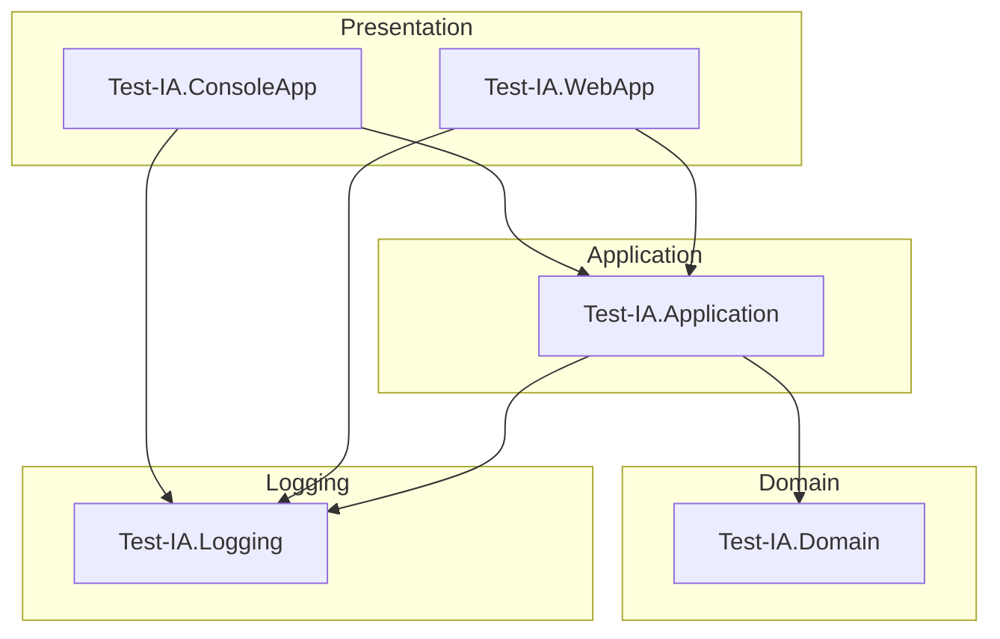

# Test-IA

A .NET 10.0 solution that demonstrates Active Directory user and group lookup services using real LDAP connections with Windows Integrated Authentication.

## Table of Contents

- [Overview](#overview)
- [Architecture](#architecture)
- [Layer Responsibilities](#layer-responsibilities)
- [Projects](#projects)
- [Public Services](#public-services)
- [Dependency Injection](#dependency-injection)
- [Configuration](#configuration)
- [Getting Started](#getting-started)
- [Testing](#testing)
- [Coding Standards](#coding-standards)
- [Technology Stack](#technology-stack)
- [Repository Structure](#repository-structure)
- [Last Updated](#last-updated)

## Overview

**Test-IA** is a .NET 10.0 solution that demonstrates Active Directory (AD DS) user and group information retrieval using real LDAP connections with Windows Integrated Authentication. The solution includes **group-based authorization** that restricts access to users who are members of a configured Active Directory group (e.g., "Employees of IT").

## Architecture

The solution uses **Clean Architecture** with the following layers:



## Layer Responsibilities

| Layer | Responsibility |
|---|---|
| **Domain** | Service interfaces (`IGetADUserInfo`, `IGetADGroupInfo`, `IUserGroupAuthorizationService`, `IUserWriter`), DTOs (`UserDto`, `GroupDto`), and domain exceptions (`DomainException`, `AccessDeniedException`, `MissingGroupException`) |
| **Application** | Service implementations, Active Directory discovery (with internal caching), LDAP connection management, group authorization logic, DI registration, **Attribute Mapper pattern** for LDAP-to-DTO mapping with `GetDisplayValues()` for dynamic rendering |
| **Logging** | `ILoggerService` abstraction wrapping `Microsoft.Extensions.Logging.ILogger` |
| **ConsoleApp** | Composition root, service registration, authorization check, and demonstration of real AD operations with dynamic attribute display via `GetDisplayValues()` |
| **WebApp** | ASP.NET Core Razor Pages presentation layer with HTML5 interface, dynamic attribute display via `GetDisplayValues()`, Glassmorphism + Aurora UI |

## Projects

| Project | Type | Target Framework | Description | Depends On |
|---|---|---|---|---|
| Test-IA.Domain | Class Library | net10.0 | Domain interfaces, DTOs, and exceptions | None |
| Test-IA.Application | Class Library | net10.0 | Service implementations, AD discovery, LDAP access, Attribute Mappers | Test-IA.Domain |
| Test-IA.Logging | Class Library | net10.0 | Logging abstraction | None |
| Test-IA.ConsoleApp | Console Application | net10.0 | Composition root and AD demonstration | Test-IA.Application, Test-IA.Logging |
| Test-IA.WebApp | Web Application | net10.0 | ASP.NET Core Razor Pages web interface for AD lookups | Test-IA.Application, Test-IA.Domain, Test-IA.Logging |
| Test-IA.Tests | Test Project | net10.0 | Unit tests for all projects | Test-IA.Domain, Test-IA.Application, Test-IA.Logging |

## Public Services

### IGetADUserInfo

Retrieves Active Directory user information by `samAccountName`.

**Returns:** `UserDto` with `DisplayName`, `EmployeeId`, `Mail`, `UserPrincipalName`, `Info`, and `Mobile`

### IGetADGroupInfo

Retrieves Active Directory group information by `samAccountName`.

**Returns:** `GroupDto` with `DisplayName` and `Members` (array of resolved display names, not DNs)

### IUserGroupAuthorizationService

Checks whether the current Windows user is a member of a configured Active Directory group.

**Returns:** `bool` — `true` if the user is a group member, `false` otherwise.

### IUserWriter

Updates Active Directory user attributes via LDAP modify operations.

**Supported attributes:** `info`, `mobile`, `streetAddress`, `l` (city), `st` (state), `postalCode`, `department`, `title`, `telephoneNumber`

## Dependency Injection

All services are registered via `ServiceCollectionExtensions.AddTestIAServices()` in the composition root (`Program.cs`). Services are registered as **Scoped** (new instance per DI scope).

**Registrations:**
- `ADDomainDiscoveryService` → Scoped
- `IAttributeMapper<UserDto>` / `UserAttributeMapper` → Scoped
- `IAttributeMapper<GroupDto>` / `GroupAttributeMapper` → Scoped
- `IGetADUserInfo` / `GetADUserInfoService` → Scoped
- `IGetADGroupInfo` / `GetADGroupInfoService` → Scoped
- `IUserGroupAuthorizationService` / `UserGroupAuthorizationService` → Scoped
- `IUserWriter` / `UserWriterService` → Scoped

## Configuration

- **ConsoleApp:** `appsettings.json` and `appsettings.Development.json` with structured logging configuration via `Microsoft.Extensions.Configuration.Json`.
- **WebApp:** ASP.NET Core default configuration (`appsettings.json`, `appsettings.Development.json`, environment variables).
- **Authorization:** `Authorization.RequiredGroup` in `appsettings.json` — the AD group `sAMAccountName` that users must be a member of to access the application.

## Getting Started

### Prerequisites

- Windows machine joined to an Active Directory domain
- .NET 10.0 SDK installed

### Console Application

```powershell
dotnet restore
dotnet build
dotnet run --project src/Test-IA.ConsoleApp
```

The console application will:
1. Discover the Active Directory environment
2. Check if the current user is a member of the configured authorization group (e.g., "Employees of IT")
3. Search for user `MFVA649T`
4. Search for group `employees of MADRID`
5. Display results through the logging abstraction

**Authorization:** If the current user is not a member of the configured group, the application logs an error and exits immediately. If the configured group does not exist in Active Directory, the application logs a `MissingGroupException` and exits.

**Web Application:**
```powershell
dotnet restore
dotnet build
dotnet run --project src/Test-IA.WebApp
```

The web application will start a Kestrel web server and serve the Razor Pages interface at `https://localhost:5001` (or the configured HTTPS port). Open a browser and navigate to the URL to access the Active Directory lookup interface.

**Authorization:** The web application requires Windows Integrated Authentication. Users must be authenticated via Kerberos/NTLM and be a member of the configured authorization group (e.g., "Employees of IT"). Non-authenticated or non-member users receive a 401 Unauthorized response.

## Testing

**Framework:** xUnit with NSubstitute and FluentAssertions

**Command:**
```powershell
dotnet test
```

**Test Categories:**
- **LoggingServiceTests** (7 tests) — Constructor validation, null message handling, valid message handling
- **GetADUserInfoServiceTests** (3 tests) — Discovery failure, null/empty samAccountName
- **GetADGroupInfoServiceTests** (3 tests) — Discovery failure, null/empty samAccountName
- **MissingGroupExceptionTests** (3 tests) — Exception construction, inheritance from DomainException
- **UserGroupAuthorizationServiceTests** (6 tests) — Discovery failure, constructor validation, null dependency checks

> Tests pending execution.

## Coding Standards

- **Nullable reference types:** Enabled
- **File-scoped namespaces:** Used
- **Implicit usings:** Enabled
- **XML documentation comments:** Mandatory for all public members
- **Modern C# features:** Primary constructors, collection expressions, pattern matching
- **Async/await:** Used for I/O operations with `CancellationToken`
- **Exception handling:** Domain exceptions with proper wrapping

## Technology Stack

| Category | Technology |
|---|---|
| Framework | .NET 10.0 |
| Language | C# |
| DI Container | Microsoft.Extensions.DependencyInjection |
| Configuration | Microsoft.Extensions.Configuration.Json, Microsoft.Extensions.Options |
| Logging | Microsoft.Extensions.Logging |
| LDAP Access | System.DirectoryServices.Protocols |
| AD Discovery | System.DirectoryServices.ActiveDirectory |
| Windows Auth | System.Security.Principal.WindowsIdentity |
| Web Auth | Microsoft.AspNetCore.Authentication.Negotiate |
| Testing | xUnit, NSubstitute, FluentAssertions |

## Repository Structure

```
Test-IA/
├── src/
│   ├── Test-IA.Domain/          # Interfaces, DTOs, exceptions
│   ├── Test-IA.Application/     # Service implementations, AD discovery, Attribute Mappers
│   ├── Test-IA.Logging/         # Logging abstraction
│   ├── Test-IA.ConsoleApp/      # Composition root, Main method
│   └── Test-IA.WebApp/          # ASP.NET Core Razor Pages web interface
├── tests/
│   └── Test-IA.Tests/           # xUnit tests
├── Test-IA.slnx                  # Solution file
└── memory-bank/                  # Project memory bank
```

## Last Updated

18/08/2026 14:11
