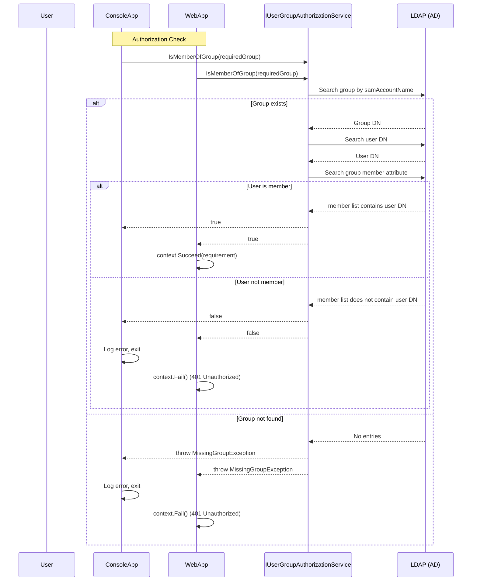

# System Patterns: Test-IA

## Architecture

**Clean Architecture** with five layers:

```
┌─────────────────────────────────────────────────────────────┐
│               Test-IA.WebApp (Presentation)                 │
│  (Razor Pages, Glassmorphism + Aurora UI)                   │
├─────────────────────────────────────────────────────────────┤
│               Test-IA.ConsoleApp                            │
│  (Composition Root, DI registration, real execution)        │
├─────────────────────────────────────────────────────────────┤
│               Test-IA.Application                           │
│  (Service implementations, AD discovery, LDAP operations)   │
├─────────────────────────────────────────────────────────────┤
│               Test-IA.Domain                                │
│  (Interfaces, DTOs, Domain Exceptions)                      │
├─────────────────────────────────────────────────────────────┤
│               Test-IA.Logging                               │
│  (ILoggerService abstraction over Microsoft.Extensions.)    │
└─────────────────────────────────────────────────────────────┘
```

### Dependency Flow

```
WebApp → Application → Domain
ConsoleApp → Application → Domain
WebApp → Logging
ConsoleApp → Logging
Tests → Application, Domain, Logging
```

Domain has NO external dependencies. Application depends only on Domain (plus Microsoft.Extensions and System.DirectoryServices packages). Logging is standalone. WebApp and ConsoleApp are presentation layers that depend on Application and Logging.

## Key Technical Decisions

### 1. Dynamic Active Directory Discovery

The `ADDomainDiscoveryService` performs a three-step discovery process:

1. **Domain**: Uses `System.DirectoryServices.ActiveDirectory.Domain.GetCurrentDomain()` to determine the domain the machine is joined to.
2. **Domain Controller**: Uses `System.DirectoryServices.DirectoryEntry("LDAP://RootDSE")` to obtain the `dnsHostName` of the Domain Controller.
3. **Base DN**: Opens an LDAP connection to the discovered DC and queries RootDSE for the `defaultNamingContext` attribute.

This ensures zero static configuration of AD connection parameters.

### 2. Windows Integrated Authentication

All LDAP connections use `AuthType.Negotiate`, which allows Windows to negotiate the appropriate authentication protocol (Kerberos when available, NTLM as fallback). No credentials are stored or transmitted by the application.

### 3. LDAP Filter Escaping

The `LdapFilterHelper` class manually escapes special LDAP characters (`\`, `*`, `(`, `)`, `\0`) to prevent LDAP injection. It is used before constructing search filters from user input.

### 4. Service Abstraction

Service interfaces are defined in the Domain layer:
- `IGetADUserInfo` → `GetADUserInfoService`
- `IGetADGroupInfo` → `GetADGroupInfoService`

This allows the services to be replaced or mocked in tests.

### 5. Attribute Mapper Pattern

A generic `IAttributeMapper<TDto>` interface in the Application layer centralizes LDAP-to-DTO mapping:
- `IAttributeMapper<TDto>` — declares `Attributes` dictionary and `Map(SearchResultEntry)` method
- `UserAttributeMapper` — implements `IAttributeMapper<UserDto>`, maps `displayName`, `employeeID`, `mail`, `userPrincipalName`
- `GroupAttributeMapper` — implements `IAttributeMapper<GroupDto>`, maps `displayName` + `member` DN array

Mappers are injected via DI into their respective services, replacing the previous static `_attributeNames` dictionaries. This provides a reusable, testable pattern for future DTOs. To add a new DTO, create a new mapper implementation and register it in DI.

### 6. Logging Abstraction

The `ILoggerService` interface wraps `Microsoft.Extensions.Logging.ILogger` to provide a consistent logging abstraction. This decouples the console app from the specific logging framework and allows for alternative logging implementations.

### 6. Windows Integrated Authentication with Group Authorization

Both ConsoleApp and WebApp require users to be members of a configured Active Directory group to access the application:

- **ConsoleApp**: Authorization check at startup. If the group doesn't exist (`MissingGroupException`) or the user is not a member (`AccessDeniedException`), the application logs an error and exits.
- **WebApp**: Uses ASP.NET Core Windows Authentication (`AddNegotiate()`) + policy-based authorization (`AddPolicy("RequiredGroup")`). `GroupAuthorizationHandler` uses `IServiceScopeFactory` to resolve scoped `IUserGroupAuthorizationService` within a scope. Non-member users receive 401 Unauthorized.
- **Configuration**: `Authorization.RequiredGroup` in `appsettings.json` is configurable per environment. Both applications use the same `AuthorizationSettings` class.
- **Service**: `UserGroupAuthorizationService` checks group membership via LDAP. Throws `MissingGroupException` if group not found, returns `false` if user not found or not a member.

## Component Relationships

```mermaid
graph TD
    subgraph Presentation_Layer["Presentation Layer"]
        console_app["Test-IA.ConsoleApp<br/>Program.cs<br/>Composition Root / DI"]
        web_app["Test-IA.WebApp<br/>Program.cs<br/>Razor Pages Pipeline"]
        page_handler["IndexModel<br/>Pages/Index.cshtml.cs<br/>Page Handler"]
    end

    subgraph Application_Layer["Application Layer"]
        svc_reg["ServiceCollectionExtensions<br/>DI Registration"]
        ad_discovery["ADDomainDiscoveryService<br/>Domain / DC / Base DN Discovery"]
        user_svc["GetADUserInfoService<br/>IGetADUserInfo Impl."]
        group_svc["GetADGroupInfoService<br/>IGetADGroupInfo Impl."]
        ldap_helper["LdapFilterHelper<br/>LDAP Filter Escaping"]
    end

    subgraph Domain_Layer["Domain Layer"]
        i_user["IGetADUserInfo<br/>User Lookup Contract"]
        i_group["IGetADGroupInfo<br/>Group Lookup Contract"]
        user_dto["UserDto<br/>displayName, employeeID, mail, UPN"]
        group_dto["GroupDto<br/>displayName, members"]
        domain_ex["DomainException<br/>Base Domain Exception"]
        user_not_found["UserNotFoundException"]
        group_not_found["GroupNotFoundException"]
    end

    subgraph Logging_Layer["Logging Layer"]
        i_logger["ILoggerService<br/>Logging Interface"]
        logger_impl["LoggingService<br/>ILogger Implementation"]
    end

    %% Presentation → Application
    console_app -->|depends on| svc_reg
    console_app -->|depends on| user_svc
    console_app -->|depends on| group_svc
    console_app -->|depends on| ad_discovery
    web_app -->|depends on| svc_reg
    page_handler -->|depends on| user_svc
    page_handler -->|depends on| group_svc

    %% Presentation → Logging
    console_app -->|uses| logger_impl
    web_app -->|uses| logger_impl
    page_handler -->|uses| i_logger

    %% Application → Domain
    svc_reg -->|registers| i_user
    svc_reg -->|registers| i_group
    user_svc -->|implements| i_user
    user_svc -->|uses| user_dto
    user_svc -->|uses| ad_discovery
    user_svc -->|uses| ldap_helper
    group_svc -->|implements| i_group
    group_svc -->|uses| group_dto
    group_svc -->|uses| ad_discovery
    group_svc -->|uses| ldap_helper
    ad_discovery -->|uses| domain_ex
    user_not_found -->|inherits| domain_ex
    group_not_found -->|inherits| domain_ex

    %% Logging internal
    logger_impl -->|implements| i_logger
```



## Critical Implementation Paths

### User Lookup Flow

1. `Program.Main` → resolves `IGetADUserInfo` from DI
2. `GetADUserInfoService.GetUser(samAccountName)` validates input
3. Calls `ADDomainDiscoveryService.Discover()` → gets domain, DC, Base DN
4. Creates `LdapConnection` to DC with `AuthType.Negotiate`
5. Escapes `samAccountName` via `LdapFilterHelper.Escape()`
6. Executes LDAP search: `(&(objectCategory=person)(objectClass=user)(sAMAccountName={escaped}))`
7. Extracts `displayName`, `employeeID`, `mail`, `userPrincipalName`
8. Returns `UserDto`

### Group Lookup Flow

1. `Program.Main` / `IndexModel.OnPost()` → resolves `IGetADGroupInfo` from DI
2. `GetADGroupInfoService.GetGroup(samAccountName)` validates input
3. Calls `ADDomainDiscoveryService.Discover()` → gets domain, DC, Base DN
4. Creates `LdapConnection` to DC with `AuthType.Negotiate`
5. Escapes `samAccountName` via `LdapFilterHelper.Escape()`
6. Executes LDAP search: `(&(objectCategory=group)(sAMAccountName={escaped}))`
7. Extracts `displayName`, `member` (as string array of Distinguished Names)
8. Calls `ResolveMemberDisplayNamesAsync()` to resolve each member DN to its `displayName` attribute
   - For each DN, performs an LDAP search with `SearchScope.Subtree` for the `displayName` attribute
   - Falls back to DN if resolution fails (logged as warning)
9. Returns `GroupDto` with display names instead of DNs

## Design Patterns in Use

- **Dependency Injection**: All services registered via `IServiceCollection`. Composition root in `Program.cs`.
- **Service Collection Extensions**: `ServiceCollectionExtensions.AddTestIAServices()` provides a single registration method.
- **Record Types**: `UserDto` and `GroupDto` use C# record types for immutable data transfer.
- **Domain Exception Pattern**: Custom exceptions (`UserNotFoundException`, `GroupNotFoundException`) inheriting from `DomainException` for domain-specific error handling.
- **Facade Pattern**: `ADDomainDiscoveryService` encapsulates the complexity of domain, DC, and Base DN discovery behind a single `Discover()` method.
- **Attribute Mapper Pattern**: `IAttributeMapper<TDto>` generic interface centralizes LDAP-to-DTO mapping. `UserAttributeMapper` and `GroupAttributeMapper` implement it. Mappers are injected via DI, providing a reusable pattern for future DTOs.
- **Factory Method**: Each mapper exposes a `Map(SearchResultEntry)` factory method that constructs the target DTO from an LDAP entry.

### 7. Authorization Flow

Both ConsoleApp and WebApp perform authorization checks before allowing access to AD services:



**ConsoleApp**: Authorization check at startup. If the group doesn't exist (`MissingGroupException`) or the user is not a member (`AccessDeniedException`), the application logs an error and exits.

**WebApp**: Uses ASP.NET Core Windows Authentication (`AddNegotiate()`) + policy-based authorization (`AddPolicy("RequiredGroup")`). `GroupAuthorizationHandler` uses `IServiceScopeFactory` to resolve scoped `IUserGroupAuthorizationService` within a scope. Non-member users receive 401 Unauthorized.

**Configuration**: `Authorization.RequiredGroup` in `appsettings.json` is configurable per environment. Both applications use the same `AuthorizationSettings` class.

**Service**: `UserGroupAuthorizationService` checks group membership via LDAP. Throws `MissingGroupException` if group not found, returns `false` if user not found or not a member.
