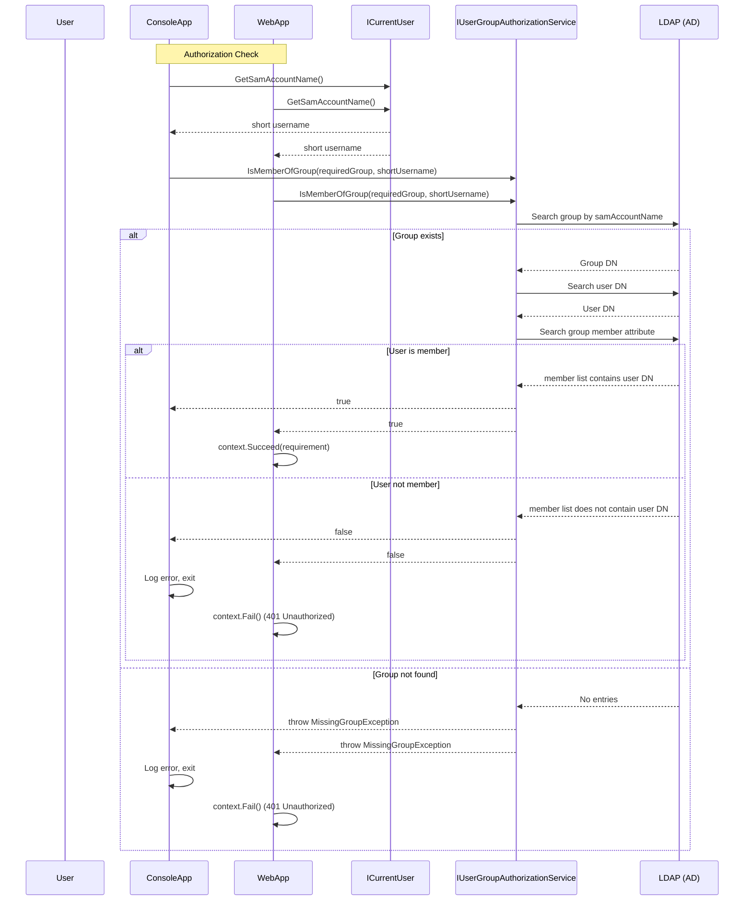

# System Patterns: Test-IA

## Architecture

**Clean Architecture** with five layers:

```
+-------------------------------------------------------------+
|               Test-IA.WebApp (Presentation)                 |
|  (Razor Pages, Glassmorphism + Aurora UI)                   |
+-------------------------------------------------------------+
|               Test-IA.ConsoleApp                            |
|  (Composition Root, DI registration, real execution)        |
+-------------------------------------------------------------+
|               Test-IA.Application                           |
|  (Service implementations, AD discovery, LDAP operations)   |
+-------------------------------------------------------------+
|               Test-IA.Domain                                |
|  (Interfaces, DTOs, Domain Exceptions)                      |
+-------------------------------------------------------------+
|               Test-IA.Logging                               |
|  (ILoggerService abstraction over Microsoft.Extensions.)    |
+-------------------------------------------------------------+
```

### Dependency Flow

```
WebApp → Application → Domain
ConsoleApp → Application → Domain
WebApp → Logging
ConsoleApp → Logging
Tests → Application, Domain, Logging
```

Domain has NO external dependencies. Application depends only on Domain (plus Microsoft.Extensions and System.DirectoryServices packages). Logging is standalone. WebApp and ConsoleApp are presentation layers that depend on Application and Logging.

## Key Technical Decisions

### 1. Dynamic Active Directory Discovery

The `ADDomainDiscoveryService` performs a three-step discovery process:

1. **Domain**: Uses `System.DirectoryServices.ActiveDirectory.Domain.GetCurrentDomain()` to determine the domain the machine is joined to.
2. **Domain Controller**: Uses `System.DirectoryServices.DirectoryEntry("LDAP://RootDSE")` to obtain the `dnsHostName` of the Domain Controller.
3. **Base DN**: Opens an LDAP connection to the discovered DC and queries RootDSE for the `defaultNamingContext` attribute.

This ensures zero static configuration of AD connection parameters.

### 2. Windows Integrated Authentication

All LDAP connections use `AuthType.Negotiate`, which allows Windows to negotiate the appropriate authentication protocol (Kerberos when available, NTLM as fallback). No credentials are stored or transmitted by the application.

### 3. LDAP Filter Escaping

The `LdapFilterHelper` class manually escapes special LDAP characters (`\`, `*`, `(`, `)`, `\0`) to prevent LDAP injection. It is used before constructing search filters from user input.

### 4. Service Abstraction

Service interfaces are defined in the Domain layer:
- `IGetADUserInfo` → `GetADUserInfoService`
- `IGetADGroupInfo` → `GetADGroupInfoService`
- `IGroupMembershipWriter` → `GroupMembershipWriterService`
- `IUserWriter` → `UserWriterService`
- `IUserGroupAuthorizationService` → `UserGroupAuthorizationService`

This allows the services to be replaced or mocked in tests.

### 5. Attribute Mapper Pattern

A generic `IAttributeMapper<TDto>` interface in the Application layer centralizes LDAP-to-DTO mapping:
- `IAttributeMapper<TDto>` — declares `Attributes` dictionary, `Map(SearchResultEntry)` method, and `GetDisplayValues(TDto)` method
- `UserAttributeMapper` — implements `IAttributeMapper<UserDto>`, maps 14 LDAP attributes: `displayName`, `employeeID`, `mail`, `userPrincipalName`, `info`, `mobile`, `sAMAccountName`, `streetAddress`, `l` (city), `st` (state), `postalCode`, `department`, `title`, `telephoneNumber`
- `GroupAttributeMapper` — implements `IAttributeMapper<GroupDto>`, maps `displayName` + `member` DN array
- `UserUpdateAttributeMapper` — implements `IAttributeMapper<UserUpdateRequest>`, maps 10 user update attributes using correct LDAP attribute names (`sAMAccountName`, `info`, `mobile`, `streetAddress`, `l`, `st`, `postalCode`, `department`, `title`, `telephoneNumber`)

Mappers are injected via DI into their respective services, replacing the previous static `_attributeNames` dictionaries. This provides a reusable, testable pattern for future DTOs. To add a new DTO, create a new implementation of this interface (e.g., `ComputerAttributeMapper : IAttributeMapper<ComputerDto>`) and register it in DI. The Search User and Update User panels now share the same 14-attribute `GetDisplayValues()` pattern for consistent dynamic rendering.

### 6. AD Discovery Caching

`ADDomainDiscoveryService.Discover()` caches its result internally after the first successful call:
- First call: performs the full 3-step LDAP discovery (domain → DC → Base DN), caches the result in `_cachedResult`
- Subsequent calls: returns the cached `(DomainName, DomainController, BaseDN)` tuple instantly — no LDAP queries

This prevents redundant Active Directory queries when multiple services (authorization, user lookup, group lookup) all require the environment parameters within the same application lifetime. The cache is instance-level (not static), so each DI-scoped instance caches independently. Tests remain unaffected because `ThrowingADDomainDiscoveryService` overrides `Discover()` and throws before the cache check.

### 7. Logging Abstraction

The `ILoggerService` interface wraps `Microsoft.Extensions.Logging.ILogger` to provide a consistent logging abstraction. This decouples the console app and web app from the specific logging framework and allows for alternative logging implementations.

### 8. Extensible Logging Sink Pattern

`ILoggingSink` interface defines the pluggable contract for logging output targets. `LoggingService` delegates to `IEnumerable<ILoggingSink>`, enabling file, console, database, Event Log, and other sinks.

- `FileLoggingSink` — thread-safe append mode with `FormatMessage` method that handles both numbered placeholders (`{0}`, `{1}`) and named placeholders (`{Key}`, `{Value}`) matching `ILogger` behavior. `HasNumberedPlaceholders` guard avoids `FormatException` on literal curly braces (e.g., Distinguished Names).
- `ConsoleLoggingSink` — unified formatting with `FileLoggingSink` using same `FormatMessage` and `HasNumberedPlaceholders` methods.
- `LoggingPipelineFactory` — reads `appsettings.json` `Logging.Sinks` section and instantiates configured sinks. Configuration structure: `Logging.Sinks.File.Path`, `Logging.Sinks.File.MinLogLevel`.

ConsoleApp and WebApp both register file sinks via factory. Future sinks (Database, EventLog) are added by implementing `ILoggingSink` and extending the factory.

### 9. Dynamic Display Pattern

Both ConsoleApp and WebApp use `IAttributeMapper<TDto>.GetDisplayValues(TDto)` for dynamic attribute rendering:
- **ConsoleApp**: `foreach` loops over `Dictionary<string, string>` to render user/group attributes via `ILoggerService.LogInformation()`
- **WebApp**: Razor `@foreach` loops over `Model.UserDisplayValues` and `Model.GroupDisplayValues` to render HTML table rows
- **Benefit**: Adding new attributes to a mapper automatically shows them in all presentation layers — no hardcoded HTML or logging calls needed

### 10. Windows Integrated Authentication with Group Authorization

Both ConsoleApp and WebApp require users to be members of a configured Active Directory group to access the application:

- **ConsoleApp**: Authorization check at startup. If the group doesn't exist (`MissingGroupException`) or the user is not a member (`AccessDeniedException`), the application logs an error and exits.
- **WebApp**: Uses ASP.NET Core Windows Authentication (`AddNegotiate()`) + policy-based authorization (`AddPolicy("RequiredGroup")`). `GroupAuthorizationHandler` uses `IServiceScopeFactory` to resolve scoped `IUserGroupAuthorizationService` within a scope. Non-member users receive 401 Unauthorized.
- **Configuration**: `Authorization.RequiredGroup` in `appsettings.json` is configurable per environment. Both applications use the same `AuthorizationSettings` class.
- **Service**: `UserGroupAuthorizationService` checks group membership via LDAP. Throws `MissingGroupException` if group not found, returns `false` if user not found or not a member.
- **Username parsing**: Safe parsing for three formats: `DOMAIN\Username` (extracts `Username`), `user@domain.com` UPN (strips `@domain.com`), plain usernames (used as-is).

### 11. ICurrentUser Abstraction

`ICurrentUser` interface in the Domain layer decouples identity resolution from presentation-layer mechanisms.
- `ConsoleCurrentUser` — reads `WindowsIdentity.GetCurrent()?.Name` and extracts the short `samAccountName` (after the last `\`).
- `WebCurrentUser` — reads `HttpContext.User.Identity?.Name` the same way.

Both return the short username required by LDAP `sAMAccountName` searches. The `UserGroupAuthorizationService` injects `ICurrentUser` instead of `WindowsIdentity` directly, enabling testability and clean separation.

### 12. Self-Contained Deployment Pattern

The WebApp supports self-contained deployment — the published package includes the full .NET 10.0 runtime, so no runtime installation is required on the target machine.

**Publishing Pipeline** (`scripts/publish-webapp.ps1`):
1. `dotnet clean` — removes old build artifacts
2. `dotnet restore` — downloads NuGet packages
3. `dotnet build --configuration Release` — compiles all projects
4. `dotnet test` — runs unit tests (aborts on failure)
5. `dotnet publish --self-contained true --runtime win-x64` — produces the self-contained bundle
6. `Compress-Archive` + embedded README — wraps into a timestamped `.zip`

**Project Properties**: `Test-IA.WebApp.csproj` includes `<RuntimeIdentifier>win-x64</RuntimeIdentifier>` and `<SelfContained>true</SelfContained>`. `PublishSingleFile` is kept as `false` because it causes >30s timeouts when combined with self-contained.

**Deployment Package** (`releases/Test-IA.WebApp-deploy-*.zip`): ~46.5 MB containing `Test-IA.WebApp.exe`, all application DLLs, `appsettings.json`, `README-deploy.txt`, and the bundled .NET runtime (`coreclr.dll`, `hostfxr.dll`, `hostpolicy.dll`).

**Deployment Steps**: Copy zip → extract → run `Test-IA.WebApp.exe` → access at `http://localhost:5000`. For production, register as a Windows service using NSSM.

## Component Relationships

```mermaid
graph TD
    subgraph Presentation_Layer["Presentation Layer"]
        console_app["Test-IA.ConsoleApp<br/>Program.cs<br/>Composition Root / DI"]
        web_app["Test-IA.WebApp<br/>Program.cs<br/>Razor Pages Pipeline"]
        page_handler["IndexModel<br/>Pages/Index.cshtml.cs<br/>Page Handler"]
        groups_page["GroupsModel<br/>Pages/Groups.cshtml.cs<br/>Group Management"]
        users_page["UsersModel<br/>Pages/Users.cshtml.cs<br/>User Management"]
    end

    subgraph Application_Layer["Application Layer"]
        svc_reg["ServiceCollectionExtensions<br/>DI Registration"]
        ad_discovery["ADDomainDiscoveryService<br/>Domain / DC / Base DN Discovery"]
        user_svc["GetADUserInfoService<br/>IGetADUserInfo Impl."]
        group_svc["GetADGroupInfoService<br/>IGetADGroupInfo Impl."]
        membership_svc["GroupMembershipWriterService<br/>IGroupMembershipWriter Impl."]
        user_writer_svc["UserWriterService<br/>IUserWriter Impl."]
        auth_svc["UserGroupAuthorizationService<br/>IUserGroupAuthorizationService Impl."]
        ldap_helper["LdapFilterHelper<br/>LDAP Filter Escaping"]
        user_mapper["UserAttributeMapper<br/>IAttributeMapper<UserDto>"]
        group_mapper["GroupAttributeMapper<br/>IAttributeMapper<GroupDto>"]
        update_mapper["UserUpdateAttributeMapper<br/>IAttributeMapper<UserUpdateRequest>"]
    end

    subgraph Domain_Layer["Domain Layer"]
        i_user["IGetADUserInfo<br/>User Lookup Contract"]
        i_group["IGetADGroupInfo<br/>Group Lookup Contract"]
        i_membership["IGroupMembershipWriter<br/>Group Write Contract"]
        i_user_writer["IUserWriter<br/>User Update Contract"]
        i_auth["IUserGroupAuthorizationService<br/>Authorization Contract"]
        i_current_user["ICurrentUser<br/>Identity Abstraction"]
        user_dto["UserDto<br/>14 LDAP attributes"]
        group_dto["GroupDto<br/>displayName, members"]
        group_result["GroupMemberOperationResult"]
        update_request["UserUpdateRequest"]
        domain_ex["DomainException<br/>Base Domain Exception"]
        user_not_found["UserNotFoundException"]
        group_not_found["GroupNotFoundException"]
        access_denied["AccessDeniedException"]
        missing_group["MissingGroupException"]
    end

    subgraph Logging_Layer["Logging Layer"]
        i_logger["ILoggerService<br/>Logging Interface"]
        logger_impl["LoggingService<br/>ILogger Implementation"]
        i_sink["ILoggingSink<br/>Sink Contract"]
        file_sink["FileLoggingSink<br/>Thread-safe file output"]
        console_sink["ConsoleLoggingSink<br/>Console output"]
        pipeline_factory["LoggingPipelineFactory<br/>Sink instantiation"]
    end

    %% Presentation → Application
    console_app -->|depends on| svc_reg
    console_app -->|depends on| user_svc
    console_app -->|depends on| group_svc
    console_app -->|depends on| ad_discovery
    console_app -->|depends on| auth_svc
    console_app -->|depends on| user_mapper
    console_app -->|depends on| group_mapper
    web_app -->|depends on| svc_reg
    web_app -->|depends on| user_svc
    web_app -->|depends on| group_svc
    web_app -->|depends on| membership_svc
    web_app -->|depends on| user_writer_svc
    web_app -->|depends on| auth_svc
    web_app -->|depends on| user_mapper
    web_app -->|depends on| group_mapper
    web_app -->|depends on| update_mapper
    page_handler -->|depends on| user_svc
    page_handler -->|depends on| group_svc
    groups_page -->|depends on| group_svc
    groups_page -->|depends on| membership_svc
    users_page -->|depends on| user_svc
    users_page -->|depends on| user_writer_svc

    %% Presentation → Logging
    console_app -->|uses| logger_impl
    web_app -->|uses| logger_impl
    page_handler -->|uses| i_logger

    %% Application → Domain
    svc_reg -->|registers| i_user
    svc_reg -->|registers| i_group
    svc_reg -->|registers| i_membership
    svc_reg -->|registers| i_user_writer
    svc_reg -->|registers| i_auth
    svc_reg -->|registers| i_current_user
    user_svc -->|implements| i_user
    user_svc -->|uses| user_dto
    user_svc -->|uses| ad_discovery
    user_svc -->|uses| ldap_helper
    user_svc -->|uses| user_mapper
    group_svc -->|implements| i_group
    group_svc -->|uses| group_dto
    group_svc -->|uses| ad_discovery
    group_svc -->|uses| ldap_helper
    group_svc -->|uses| group_mapper
    membership_svc -->|implements| i_membership
    membership_svc -->|uses| ad_discovery
    membership_svc -->|uses| ldap_helper
    user_writer_svc -->|implements| i_user_writer
    user_writer_svc -->|uses| ad_discovery
    user_writer_svc -->|uses| ldap_helper
    user_writer_svc -->|uses| update_mapper
    auth_svc -->|implements| i_auth
    auth_svc -->|uses| i_current_user
    auth_svc -->|uses| ad_discovery
    auth_svc -->|uses| ldap_helper
    ad_discovery -->|uses| domain_ex
    user_not_found -->|inherits| domain_ex
    group_not_found -->|inherits| domain_ex
    access_denied -->|inherits| domain_ex
    missing_group -->|inherits| domain_ex

    %% Logging internal
    logger_impl -->|implements| i_logger
    logger_impl -->|delegates to| i_sink
    logger_impl -->|uses| file_sink
    logger_impl -->|uses| console_sink
    pipeline_factory -->|creates| file_sink
    pipeline_factory -->|creates| console_sink
```



## Critical Implementation Paths

### User Lookup Flow

1. `Program.Main` / `IndexModel.OnPost()` → resolves `IGetADUserInfo` from DI
2. `GetADUserInfoService.GetUser(samAccountName)` validates input
3. Calls `ADDomainDiscoveryService.Discover()` → gets domain, DC, Base DN
4. Creates `LdapConnection` to DC with `AuthType.Negotiate`
5. Escapes `samAccountName` via `LdapFilterHelper.Escape()`
6. Executes LDAP search: `(&(objectCategory=person)(objectClass=user)(sAMAccountName={escaped}))`
7. Extracts 14 attributes via `UserAttributeMapper.Map()`
8. Returns `UserDto`

### Group Lookup Flow

1. `Program.Main` / `IndexModel.OnPost()` → resolves `IGetADGroupInfo` from DI
2. `GetADGroupInfoService.GetGroupAsync(samAccountName)` validates input
3. Calls `ADDomainDiscoveryService.Discover()` → gets domain, DC, Base DN
4. Creates `LdapConnection` to DC with `AuthType.Negotiate`
5. Escapes `samAccountName` via `LdapFilterHelper.Escape()`
6. Executes LDAP search: `(&(objectCategory=group)(sAMAccountName={escaped}))`
7. Extracts attributes via `GroupAttributeMapper.Map()`
8. Calls `ResolveMemberDisplayNamesAsync()` to resolve each member DN to its `displayName` attribute
   - For each DN, performs an LDAP search with `SearchScope.Subtree` for the `displayName` attribute
   - Falls back to DN if resolution fails (logged as warning)
9. Returns `GroupDto` with display names instead of DNs

### Authorization Flow

Both ConsoleApp and WebApp perform authorization checks before allowing access to AD services:



**ConsoleApp**: Authorization check at startup. If the group doesn't exist (`MissingGroupException`) or the user is not a member (`AccessDeniedException`), the application logs an error and exits.

**WebApp**: Uses ASP.NET Core Windows Authentication (`AddNegotiate()`) + policy-based authorization (`AddPolicy("RequiredGroup")`). `GroupAuthorizationHandler` uses `IServiceScopeFactory` to resolve scoped `IUserGroupAuthorizationService` within a scope. Non-member users receive 401 Unauthorized.

## Design Patterns in Use

- **Dependency Injection**: All services registered via `IServiceCollection`. Composition root in `Program.cs`.
- **Service Collection Extensions**: `ServiceCollectionExtensions.AddTestIAServices()` provides a single registration method.
- **Record Types**: `UserDto` and `GroupDto` use C# record types for immutable data transfer.
- **Domain Exception Pattern**: Custom exceptions (`UserNotFoundException`, `GroupNotFoundException`, `AccessDeniedException`, `MissingGroupException`) inheriting from `DomainException` for domain-specific error handling.
- **Facade Pattern**: `ADDomainDiscoveryService` encapsulates the complexity of domain, DC, and Base DN discovery behind a single `Discover()` method.
- **Caching / Flyweight**: `ADDomainDiscoveryService.Discover()` caches its result internally after the first successful call. Subsequent calls return the cached tuple without performing another LDAP discovery.
- **Attribute Mapper Pattern**: `IAttributeMapper<TDto>` generic interface centralizes LDAP-to-DTO mapping. `UserAttributeMapper`, `GroupAttributeMapper`, and `UserUpdateAttributeMapper` implement it. Mappers are injected via DI, providing a reusable pattern for future DTOs. Each mapper also implements `GetDisplayValues(TDto)` for dynamic console/web display.
- **Factory Method**: Each mapper exposes a `Map(SearchResultEntry)` factory method that constructs the target DTO from an LDAP entry.
- **Extensible Sink Pattern**: `ILoggingSink` interface defines the pluggable contract. `LoggingService` delegates to `IEnumerable<ILoggingSink>`. `LoggingPipelineFactory` reads configuration and creates sinks.
- **Identity Abstraction**: `ICurrentUser` interface decouples identity resolution from presentation layers. `ConsoleCurrentUser` and `WebCurrentUser` implement it for different environments.
- **Policy-Based Authorization**: ASP.NET Core `AuthorizationHandler<TRequirement>` pattern with `GroupAuthorizationRequirement` and `GroupAuthorizationHandler`.
